<div align="center">

# Coffee Leaf Vision

**Clasificador de enfermedades en hojas de café por visión por computador con explicabilidad Grad-CAM**


</div>

---

## Resumen

CoffeeLeafVision diagnostica enfermedades del café a partir de una imagen de la hoja. Compara 4 arquitecturas deep learning con 5-fold cross-validation, incluye explicabilidad visual mediante Grad-CAM, y se entrega como una demo pública en Hugging Face Spaces.

## Datasets

- **BRACOL** — 1,747 imágenes reales de café arábico ([Mendeley Data](https://data.mendeley.com/datasets/yy2k5y8mxg/1))
- **RoCoLe** — 1,560 imágenes reales de café robusta ([Mendeley Data](https://data.mendeley.com/datasets/c5yvn32dzg/2))
- **Total combinado:** ~3,307 imágenes reales en 5 clases

5 clases unificadas tras armonización: `healthy`, `leaf_rust`, `leaf_miner`, `phoma`, `cercospora`.

**Regla del proyecto:** sin datos sintéticos. Augmentation estándar (rotación, flip, color jitter) sobre imágenes reales sí.

## Resultados — modelo en producción (v2-leaf)

| Métrica | Valor (5-fold CV) |
|---------|-----------------:|
| Arquitectura | **ViT-Small** |
| Accuracy | **0.9102 ± 0.0124** |
| F1 macro | **0.8629 ± 0.0160** |
| AUC macro | **0.9855** |

Entrenado sobre **BRACOL leaf** (hojas completas) + **RoCoLe** = 3,078 imágenes reales.

### Por qué F1 0.86 en `leaf` es mejor que F1 0.95 en `symptom`

Un experimento previo entrenado sobre BRACOL `symptom` (síntomas pre-recortados sobre fondo neutro) alcanzaba F1 0.95, pero generalizaba mal a fotos del mundo real porque el problema era artificialmente fácil. Cambiar a `leaf` (hojas enteras, fondos heterogéneos) baja la métrica nominal pero produce un modelo más útil en producción. Es una decisión deliberada de criterio ingenieril sobre métricas de evaluación.

## Arquitectura

```mermaid
flowchart LR
    A[BRACOL + RoCoLe] -->|preprocess.py| B[(Manifest unificado)]
    B -->|stratified split| C[5-fold CV]
    C -->|src/train.py en Kaggle GPU| D[4 modelos x 5 checkpoints]
    D --> E[03_evaluation.ipynb]
    E -->|mejor modelo| F[Hugging Face Hub]
    F -->|hf_hub_download| G[FastAPI + Grad-CAM]
    G --> H[Streamlit dashboard]
    H --> I[HF Spaces Docker]
```



## Las 4 arquitecturas comparadas

| Modelo | Año | Params | Por qué |
|--------|----:|-------:|----------|
| **ResNet50** | 2015 | 25M | Baseline clásico de CNN |
| **EfficientNetV2-S** | 2021 | 22M | CNN moderna eficiente |
| **MobileNetV3-Large** | 2019 | 5.5M | Modelo ligero (edge/mobile) |
| **ViT-Small** | 2020 | 22M | Vision Transformer no-convolucional |

Cubren todo el espectro de CV moderno: CNN clásica, CNN eficiente, CNN móvil y transformer.

## Cómo correr localmente

### Prerequisitos
- Python 3.11
- Git
- Datasets BRACOL y RoCoLe descargados en `data/`
- (Opcional) GPU para entrenamiento, no necesaria para inferencia

### Setup

```bash
git clone https://github.com/JuanAlvarezgh/coffee-leaf-vision.git
cd coffee-leaf-vision
python -m venv .venv
.venv\Scripts\activate    # Windows
source .venv/bin/activate # Linux/Mac
make setup
```

### Verificar datasets

```bash
python -m src.download_datasets
```

### EDA

```bash
jupyter notebook notebooks/01_eda.ipynb
```

### Entrenar

El entrenamiento está pensado para correr en **Kaggle Notebooks** (GPU T4 gratis). Subir `notebooks/02_training.ipynb` a Kaggle, adjuntar BRACOL + RoCoLe como datasets, y ejecutar. Después subir el mejor checkpoint con `scripts/upload_to_hf.py`.

### Inferencia local

```bash
make run-api          # http://localhost:8000/docs
make run-dashboard    # http://localhost:8501
```

## Estructura del repositorio

```
coffeeleafvision/
├── api/                  # FastAPI: inferencia + Grad-CAM
├── dashboard/            # Streamlit (4 vistas)
├── data/                 # BRACOL + RoCoLe (gitignored)
├── notebooks/            # EDA, training, evaluation
├── scripts/              # upload_to_hf.py
├── src/                  # preprocess, data, models, train, evaluate, gradcam
├── tests/                # pytest
├── Dockerfile            # HF Spaces deployment
├── start.sh
└── README.md
```

## Metodología

- **Split estratificado** por clase Y variedad (Arabica/Robusta): 15% hold-out test + 5-fold CV sobre el 85% restante.
- **Transfer learning** de modelos pre-entrenados en ImageNet vía `timm`.
- **Entrenamiento en dos fases:** warm-up con backbone congelado (10 epochs) + fine-tuning completo (20 epochs) con early stopping.
- **Métricas:** Accuracy, F1 macro/weighted, AUC macro (OvR), reportadas como media ± std sobre 5 folds.
- **Explicabilidad:** Grad-CAM, Grad-CAM++ y EigenCAM seleccionables en el dashboard.

## Limitaciones

El modelo está entrenado con ~3,000 imágenes de **una hoja por foto**, en condiciones relativamente controladas. Funciona mejor sobre:

- Foto de **una sola hoja** (recortada del resto de la planta)
- Iluminación uniforme (sin sombras fuertes ni contraluces)
- Fondo simple (no muchas otras hojas ni objetos)
- Resolución razonable (no JPEG muy comprimido)

No funciona bien sobre:

- **Plantas completas** o múltiples hojas en una foto (necesitaría un pipeline de detección + clasificación)
- Fotos con filtros agresivos o muy editadas
- Variedades distintas de Arábico y Robusta (no hay Liberica ni Excelsa en el dataset)
- Fotos de campo en condiciones extremas (luz directa, sombras profundas)

Este es un **demostrador técnico**, no un producto agronómico certificado. Las recomendaciones de manejo en el dashboard son informativas; cualquier intervención real requiere validación de un agrónomo. La siguiente iteración del proyecto incluye un pipeline YOLO+clasificador para resolver el problema de hojas múltiples y plantas completas.

## Citas

- BRACOL: Krohling, R. A. _BRACOL — A Brazilian Arabica Coffee Leaf Dataset_. Mendeley Data, 2019.
- RoCoLe: Parraga-Alava, J. _RoCoLe: A robusta coffee leaf images dataset for evaluation of machine learning based methods_. Mendeley Data, 2019.

## Autor

**Juan Alvarez** — Estudiante de Ingeniería de Datos y Software, Universidad de San Buenaventura

[](https://github.com/JuanAlvarezgh)
[](https://www.linkedin.com/in/juanalvarezgh)
[](mailto:juanalvarezghcode@gmail.com)

## Licencia

[MIT](LICENSE)

---

## Contacto

[](https://www.linkedin.com/in/juanalvarezgh)
[](mailto:juanalvarezghcode@gmail.com)
[](https://github.com/JuanAlvarezgh)
